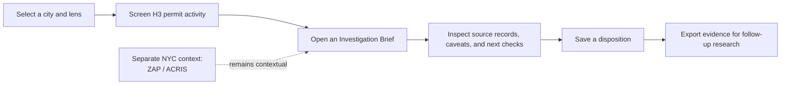

# CRE Activity Radar

CRE Activity Radar is a local prototype for a commercial-real-estate (CRE) research analyst preparing a recurring market review. It turns public permit activity into a small, auditable investigation queue: **where to research next, why an area surfaced, and which source evidence still needs verification.**

It is deliberately a research-triage workflow. It does **not** predict demand, value property, identify tenants, recommend an investment, or treat a permit as proof of a unique project, construction start, or completed work.

## 60-second reviewer path

| Question | Answer |
| --- | --- |
| **Who is it for?** | A CRE market research analyst supporting a broker's recurring market review. |
| **What does it do?** | Compares fixed permit windows in Chicago or NYC, groups mapped records into H3 cells, explains a selected cell, and lets the analyst save/export a deliberate evidence-backed disposition. |
| **Why does it matter?** | Public portals publish individual datasets. This prototype tests a workflow that carries a research question from city-level screening through record-level evidence and a next check. |
| **What is the output?** | An Investigation Brief and optional saved evidence packet, not an automated lead or a market conclusion. |

### See it quickly

- **[Watch the 9:43 narrated case study](docs/assets/Mahesh-Yerram-CRE-Activity-Radar-case-study.mp4):** the opening frames the product decision and architecture; the remainder demonstrates the live workflow, source boundaries, and operations controls.
- **Recruiter run:**

  ```powershell
  npm.cmd install
  npm.cmd run demo
  ```

  Open `http://127.0.0.1:3001`. The clean checkout starts from tracked retained samples and deterministic integration fixtures. Use `npm` in place of `npm.cmd` outside Windows PowerShell.

- **Panel path:** [architecture and decisions](#design-choices-and-deliberate-tradeoffs), [validation](#validation), and the [product brief](docs/PRODUCT_BRIEF.md).



## What is in the product

| Capability | Delivered behavior | Boundary that protects interpretation |
| --- | --- | --- |
| Discovery | Fixed-window permit queue, exact types/work-intent lenses, H3 heatmap, and transparent ranking | No cross-city leaderboard or composite opportunity score |
| Investigation | Counts, type mix, cadence, repeated supplied addresses, individual cost evidence, data quality, source links, and next checks | A pattern to investigate, never an outcome or causal conclusion |
| Analyst workflow | Recent navigation, explicit saved Signal Inventory, dispositions/notes, JSON and HTML evidence exports | Browser-local prototype storage, not a shared CRM |
| NYC property context | Exact DOB BBL join to retained PLUTO land-use categories | Parcel context is not tenancy or proof of permit purpose |
| Additional context | Separate NYC ZAP entitlements, ACRIS exact-DEED evidence, and optional SBA 504 borrower-city context | These sources never change permit ranking or heatmap colors |
| Data operations | Staged validation, snapshot identity, source-health reporting, idempotent refresh behavior | Local operations prototype; not a production admin system |

## Chicago and NYC use one workflow, not one meaning

| Topic | Chicago | New York City |
| --- | --- | --- |
| Permit source | Chicago Building Permits | DOB NOW: Build Approved Permits |
| Property context | Unavailable: no audited parcel-use join | Exact DOB BBL to retained PLUTO snapshot, with direct land-use categories |
| Cost field | `reported_cost` | `estimated_job_costs` |
| Separate context | Optional SBA borrower-city context | Optional SBA plus ZAP entitlements and bounded ACRIS recorded deeds |
| Key limitation | Issuance record is not a project, start, or property-use proof | DOB NOW is not every NYC permit system; issuance record is not a project, start, or property-use proof |

The shared interface preserves source-specific adapters and wording. Cities are switched between, never ranked against one another. Chicago property context is visibly unavailable rather than inferred from text, cost, coordinates, or a nearest parcel.

## Data sources and semantics

| Source | Used for | It cannot establish |
| --- | --- | --- |
| Chicago Building Permits | Issuance date, permit type, applicant estimate, supplied location | Unique development, start/completion, investment, demand, or property use |
| NYC DOB NOW: Build | Approved/issued record, work type, estimate, supplied location and BBL | All NYC construction activity, unique development, outcome, or tenancy |
| NYC PLUTO | Tax-lot land-use context and contracted parcel centroids | Historic use, current tenant, permit purpose, or survey-grade location |
| NYC ZAP | Public entitlement applications and validated BBL associations | Approval, completion, or a causal connection to permits |
| NYC ACRIS | Exact raw `DEED` documents and retained legal BBL associations | Staten Island coverage, sale price from `document_amt`, or redevelopment cause |
| SBA 504 | Borrower-city loan-approval context when verified data is supplied | Project geography, disbursement, construction, or space demand |

The comparison dates are fixed so that a review is reproducible:

| Window | Inclusive start / exclusive end |
| --- | --- |
| Prior | 2024-07-01 to 2025-07-01 |
| Current | 2025-07-01 to 2026-07-01 |

<details>
<summary><strong>Complete data, demo data, and refreshes</strong></summary>

The tracked demo starts immediately from retained permit samples and small deterministic integration fixtures. It is suitable for inspecting the product flow, but partial samples disable growth percentages and growth ranking; sample counts are not market totals.

For complete fixed-window Chicago and NYC permit extracts, run:

```powershell
npm.cmd run data:setup:full
npm.cmd run demo
```

This downloads more than 200 MB, stages and reconciles the official extracts, seeds SQLite, and verifies the result. `data/raw/` is intentionally not committed because the current local source files exceed normal repository-size limits. ZAP and ACRIS refresh independently via `npm.cmd run data:fetch:zap` and `npm.cmd run data:fetch:acris`. SBA ingestion requires a separately verified local CSV; the demo discloses when that context is unavailable.

Source notes and audits: [research index](docs/RESEARCH.md), [NYC property context](docs/NYC_PROPERTY_USE_AUDIT.md), [Chicago property context](docs/CHICAGO_PROPERTY_USE_AUDIT.md), [ACRIS](docs/TRANSACTION_SOURCE_AUDIT.md), and [SBA](docs/SBA_STATUS.md).
</details>

## Design choices and deliberate tradeoffs

This section is written for reviewers who want the reasoning behind the visible product.

<details open>
<summary><strong>Use an investigation queue instead of a generic dashboard</strong></summary>

The product starts from a bounded analyst decision: choose a few areas for the next research step and preserve why. That led to fixed windows, an explainable queue, an Investigation Brief, explicit dispositions, and exportable evidence. The map is geographic context; it does not make an opportunity claim.

No user interviews, adoption study, time-savings measurement, predictive validation, or willingness-to-pay research was completed. The user and value proposition are hypotheses to test with working analysts.
</details>

<details>
<summary><strong>Use two concrete source adapters before claiming a reusable pattern</strong></summary>

Chicago and NYC expose differences in identity, categories, coverage, coordinates, and parcel association. Separate adapters normalize only the stable shared concepts while preserving retained source fields and official links. This gives one investigation workflow without implying the cities or their event semantics are equivalent.
</details>

<details>
<summary><strong>Use H3 as a display bucket, with explicit precision limits</strong></summary>

Resolution-8 H3 gives a repeatable screenable grid across both markets. It is not a neighborhood, submarket, parcel, or property footprint. Records without usable coordinates remain in city totals and source accounting but do not receive an invented map location. Source coordinates and PLUTO parcel centroids remain visibly distinct; SBA borrower-city records are not forced into a cell.
</details>

<details>
<summary><strong>Prefer transparent rules over an AI or blended opportunity score</strong></summary>

There is no labeled outcome, calibrated model, or validated causal target. Combining permits, entitlements, deeds, borrower geography, and incomplete applicant estimates into one score would conceal incompatible dates, meanings, and geographic precision. The product keeps those evidence families separate and gives the analyst reviewable counts, mappings, caveats, and next checks.
</details>

<details>
<summary><strong>Choose a local TypeScript and SQLite vertical slice</strong></summary>

React/Vite renders the interface; typed Express APIs query a seeded SQLite snapshot; Node ingestion scripts and source adapters build the data. One repository makes it possible to trace a source field through normalization, API response, UI disclosure, export, and test. SQLite provides a portable, reproducible review snapshot without a hosted dependency. This is appropriate for a single-user take-home demonstration, not a production concurrency or analytics architecture.
</details>

<details>
<summary><strong>Treat refresh as a data product</strong></summary>

Acquisition freezes selected fields for the fixed period, checks source counts and identities, records checksums/manifests, and only activates a rebuilt snapshot after validation. Unchanged publisher versions can return `UP_TO_DATE`; failed staged work keeps the active verified dataset. The UI exposes dataset identity and source health so coverage can be assessed before a pattern is interpreted.
</details>

## Impediments and how the product addresses them

| Impediment | Response |
| --- | --- |
| Permit records are events, not projects | The UI names them permit activity and directs the analyst to reconcile related records before treating a pattern as a lead. |
| Sources have unequal coverage and field semantics | Two adapters retain source identity; source-health panels and contextual caveats stay attached to results. |
| Property use cannot safely be inferred everywhere | NYC uses only an exact BBL-to-PLUTO association; Chicago does not offer a guessed equivalent. |
| Applicant estimates can mislead when aggregated | The product filters and ranks by individual values but never sums them into investment. Missing is not zero. |
| More evidence can create a false composite signal | ZAP, ACRIS, and SBA stay as separate context and never alter permit discovery ranking. |
| Public data changes and downloads can fail | Staged snapshots, validation, checksums, idempotent refreshes, and explicit partial-data behavior protect the active demo. |

## Validation

The release verification covered data semantics as well as interface behavior:

```powershell
npm.cmd run data:seed
npm.cmd run data:verify
npm.cmd run typecheck
npm.cmd test
npm.cmd run build
npm.cmd run test:e2e
```

The recorded release result was 63 Vitest unit/integration tests across 16 files and 13 serial Playwright workflows from a fresh built server. Tests cover normalization, date boundaries, identity/accounting, zero baselines, property context, cost handling, refresh idempotence, ZAP/ACRIS safeguards, URL restoration, H3 refinement, and saved-lead behavior. See the [handbook verification section](docs/HANDBOOK.md#verification) for the review summary.

## Limitations, completed scope, and next work

<details open>
<summary><strong>Limitations to keep in view</strong></summary>

- Permit activity does not prove a project, construction start/completion, demand, valuation, or commercial relevance.
- Both permit sources contain mixed activity. NYC property context is limited to a retained snapshot and exact BBL association; Chicago has no equivalent in this release.
- H3 is a screening grid, and map placement inherits the available source or contracted centroid precision.
- Applicant cost fields are incomplete row-level estimates, never area investment totals.
- The bundled ZAP and ACRIS data proves integration behavior, not live or complete coverage. ACRIS is bounded to four boroughs and `document_amt` is not a sale price.
- Saved work is browser-local and the local operations controls do not implement production authentication, roles, monitoring, or retention policies.
</details>

<details>
<summary><strong>Completed in this prototype</strong></summary>

Two-market permit discovery; explainable H3 research; NYC property context; individual-estimate controls; saved leads and exports; separate ZAP/ACRIS context; guarded data operations; full-data permit bootstrap; automated tests; interview materials; and a repeatable narrated-video build.
</details>

<details>
<summary><strong>Next work, in order</strong></summary>

1. Observe working analysts preparing recurring reviews and test whether the brief improves the next research decision.
2. Add production authentication, orchestration, monitoring, retention policy, and source-service objectives before treating operations as a service.
3. Build a production-scale PLUTO refresh and audit a Chicago parcel/PIN association before adding Chicago property-use or transaction placement.
4. Evaluate licenses, certificates of occupancy, and violations as separate verified source contracts rather than adding more map layers by default.
</details>

## AI-assisted development disclosure

AI tools assisted with ideation, implementation acceleration, test and documentation drafting, and review of the local prototype. Product boundaries, data semantics, source contracts, tradeoffs, and final verification were deliberately reviewed against the actual code and retained source materials. The product makes no claim that an AI model determines the investigation queue or validates the analyst's conclusion.

## Further reading

- [Product handbook](docs/HANDBOOK.md) — detailed workflows, source inventory, corner cases, and operations.
- [Product brief and FAQ](docs/PRODUCT_BRIEF.md) — product positioning and interview-ready answers.
- [Demo script](docs/DEMO.md) — concise product walkthrough.
- [Architecture and product decisions](docs/DECISIONS.md) and [research/source notes](docs/RESEARCH.md).
