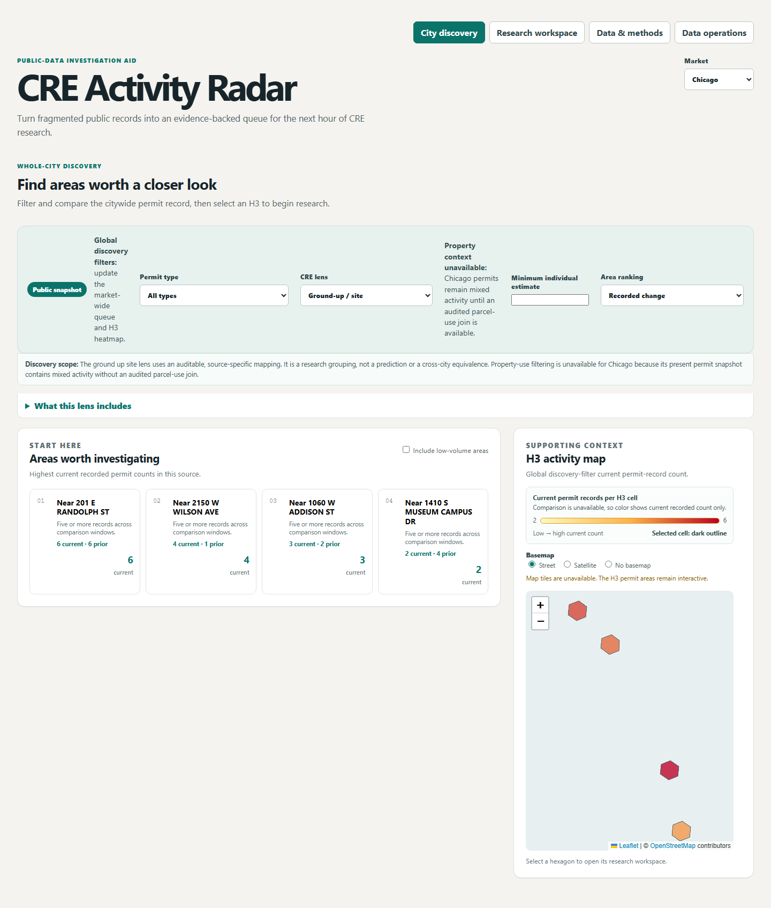
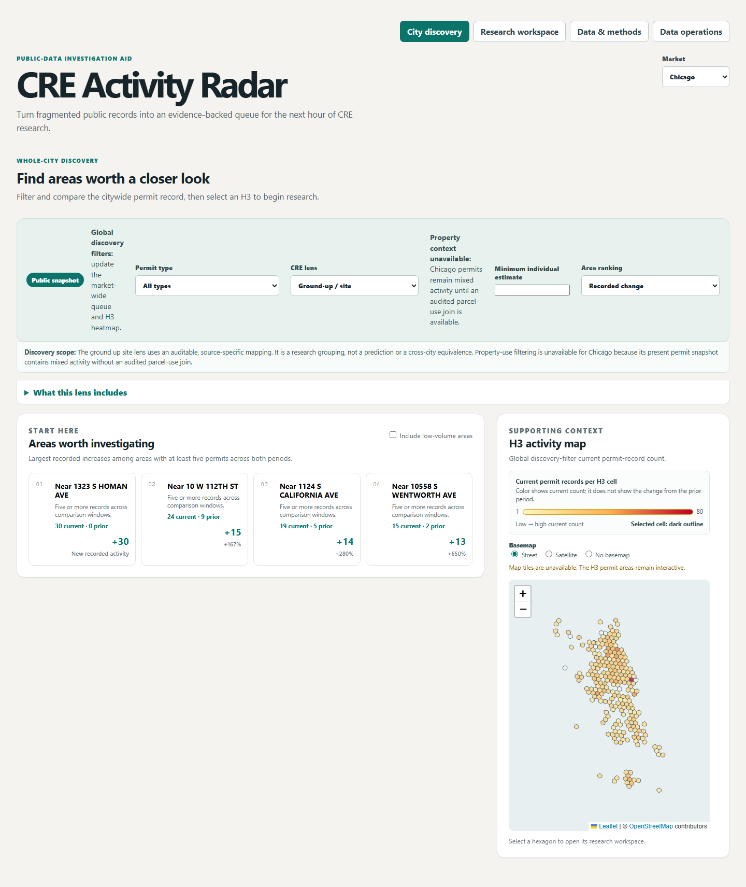
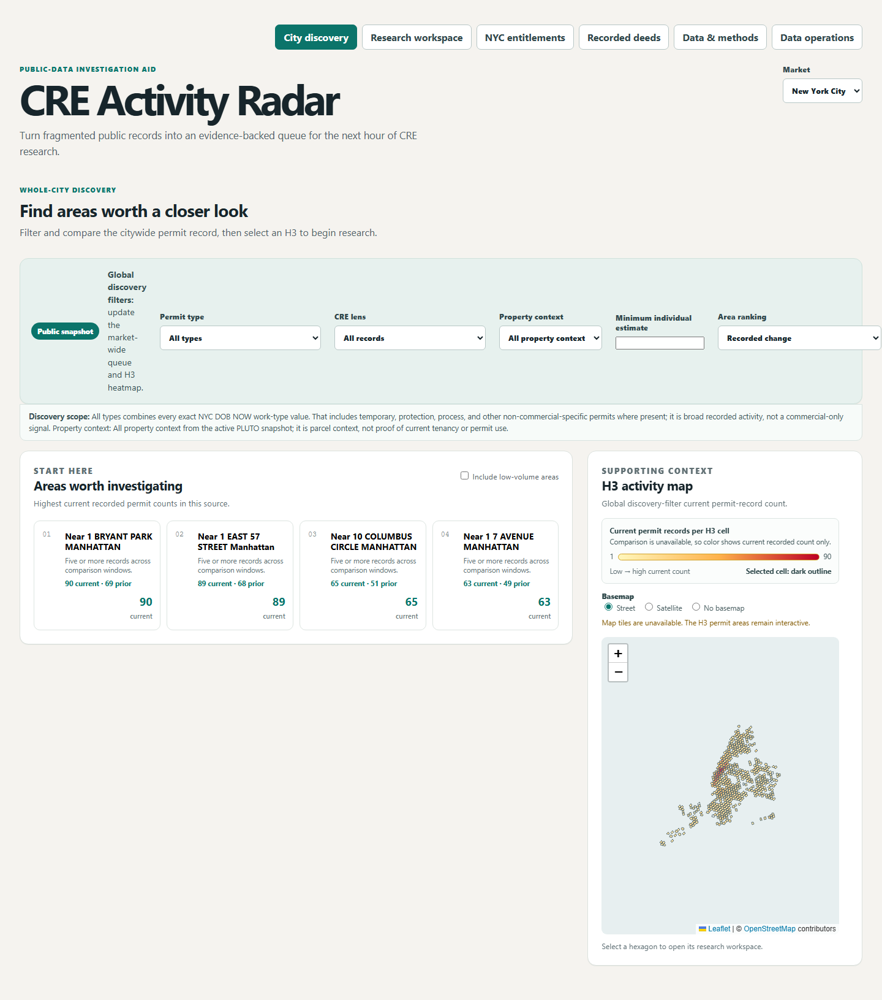
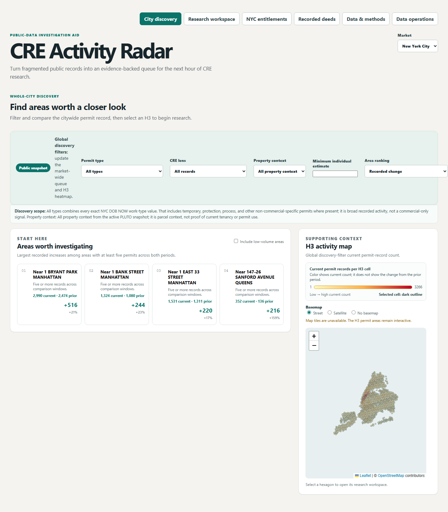
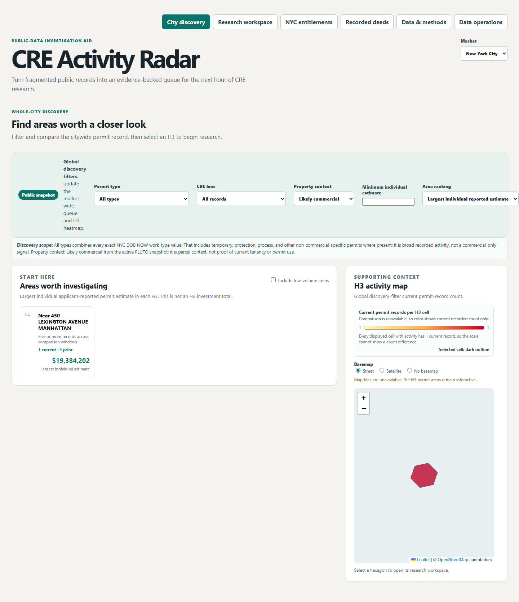
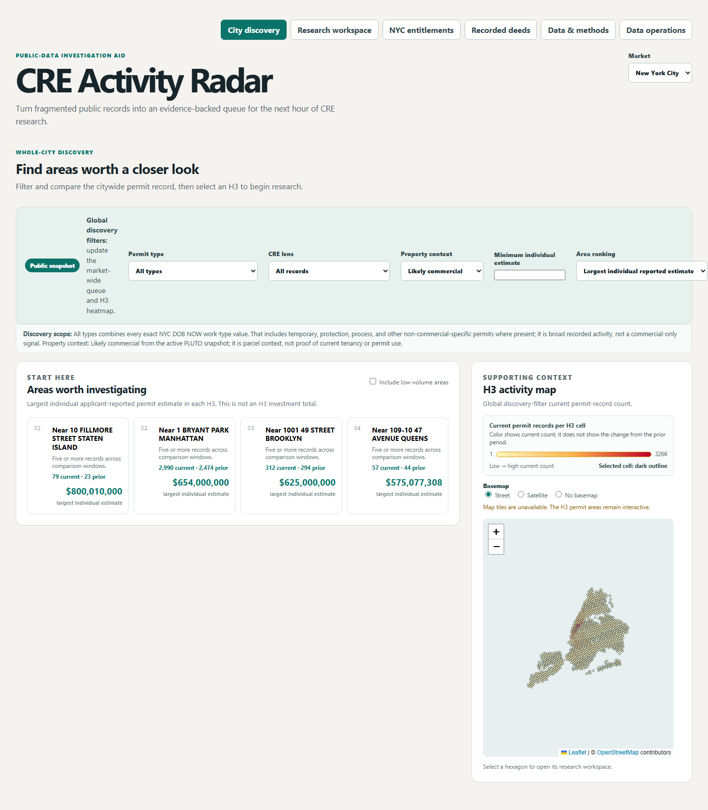
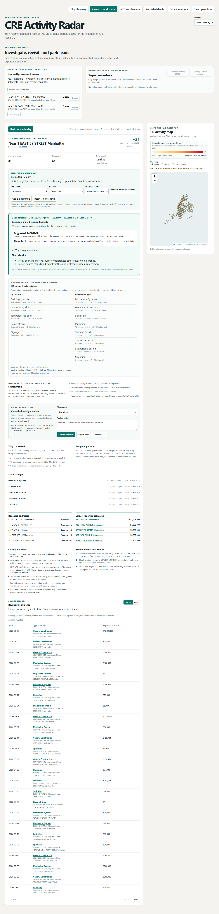
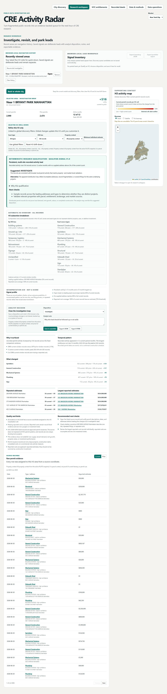
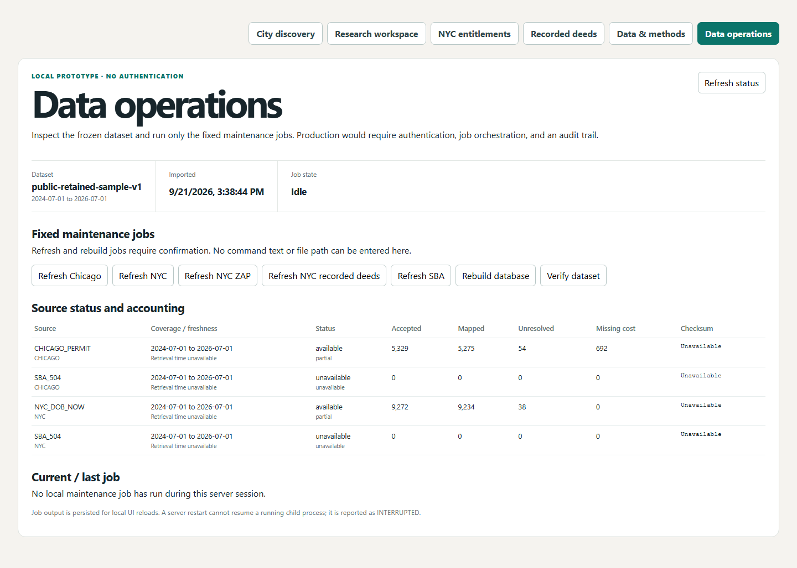
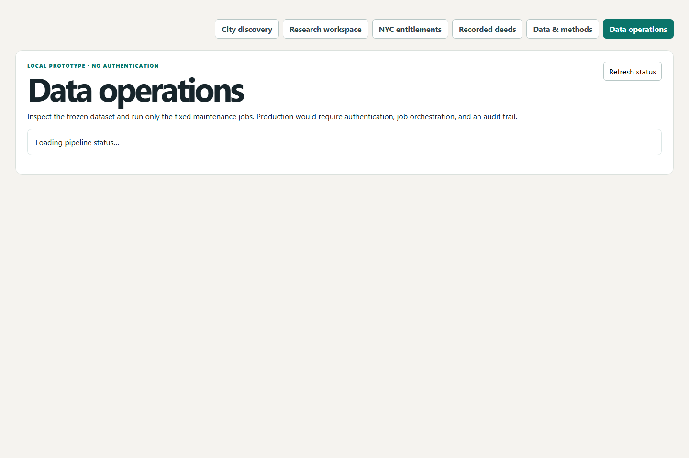

# Three-minute demo script

**Before the call:** run `npm.cmd run data:fetch:pluto` once (~1m 8s, fetches all 858,284 real
NYC parcels) and reseed. The 0:55–1:30 beat below filters to "Likely commercial" — under the
bundled 8-parcel fixture that only surfaces 1-2 H3 cells, which reads as sparse or broken on a
live call. With the live snapshot it's ~240 cells, a much stronger real demonstration of the
same feature. If you demo from the plain fixture instead, say so explicitly before this beat
("this is a proof-of-concept fixture covering 8 parcels citywide, not full coverage") rather
than letting a sparse result speak for itself.

**0:00–0:25 — frame the decision.** “A CRE research analyst has more public records than
time. CRE Activity Radar turns heterogeneous municipal records into a short, traceable
investigation queue: where should I spend the next thirty minutes, why did it surface, and
what must I verify before I hand it to a broker?”

**0:25–0:55 — show honest discovery.** Start in Chicago. Choose **Ground-up & site work**
and expand **What this lens includes**. “This is an auditable work-intent mapping, not a
commercial-property classifier. Chicago property context stays unavailable because the
retained source has no verified parcel join.” Point to the heatmap gradient and satellite
option. “H3 is a screening bucket; color is current record count, not value or demand.”

**0:55–1:30 — show the commercial boundary in NYC.** Switch to NYC. Select **Likely
commercial**, set a minimum individual estimate if useful, and rank by **Largest individual
reported estimate**. “DOB BBL joins exactly to a PLUTO snapshot. This narrows parcel context;
it does not prove tenancy or the permit's use. Cost is an individual applicant estimate and
is never summed into area investment.”

**1:30–2:10 — explain and test a lead.** Open an H3. Show its retained global scope and
independent H3 refinement. Walk through qualification, persistence, type concentration,
repeated addresses, cost coverage, next checks, and a source record. “The product helps an
analyst reject weak patterns and preserve the evidence behind a viable one. It does not call
a permit a unique project, construction start, prediction, or opportunity.”

**2:10–2:35 — close the loop.** Set a disposition, add a note, save the lead, and export the
evidence. Return through **Recently viewed areas** and **Signal inventory**. “Navigation
history and deliberate leads are separate. The useful output is a reproducible analyst
decision that can be recalled and handed to property, ownership, zoning, or broker research.”

**2:35–3:00 — prove breadth and operational trust.** Briefly open **NYC entitlements** and
**Recorded deeds** to show separately sourced context that never changes permit ranking.
Finish in **Data operations**. “Refreshes are allowlisted, staged, validated, and activated
only after verification; unchanged source versions report up to date. Source coverage and
failures stay visible.”

If asked about differentiation: government portals remain authoritative publishers. This
product adds the CRE-specific path from heterogeneous records to a qualified, saved,
exportable research decision, with source semantics and pipeline health visible throughout.
It is workflow differentiation, not a unique-data or established-moat claim.

If asked what comes next: validate the workflow with working analysts before adding another
source. Then audit Chicago parcel association and sales placement; add licenses, NYC
certificates of occupancy, or violations only as separate evidence families with explicit
source contracts.

## Reference screenshots

Real captures from a running instance, not mockups — one full pass through the app in each of
the two data modes described above, so every assertion in the script has a picture backing it.
Kept out of the script itself so the timed beats above stay clean to read aloud; matched to the
beat each one illustrates.

### City discovery — Chicago vs NYC, demo sample vs full live data

The clearest single illustration of what "demo" vs "full seed" actually means: same UI, same
code, different data volume. Matches the 0:25–0:55 and 0:55–1:30 beats.

| | Demo sample (bundled, instant) | Full live data (fetched, ~4m48s) |
| --- | --- | --- |
| **Chicago** — Ground-up & site work lens |  |  |
| **NYC** — default filters |  |  |

### 0:55–1:30 — NYC property context, "Likely commercial"

This is the pair that matters most. Under the bundled 8-parcel fixture the filter surfaces
almost nothing — under the live 858,284-parcel PLUTO snapshot it surfaces real breadth. Exactly
the gap the pre-call note above warns about.

| Demo sample (8-parcel fixture) | Full live data (858,284 real parcels) |
| --- | --- |
|  |  |

### 1:30–2:10 — Investigation Brief drill-down

Qualification signal, H3 breakdown, repeated addresses, data quality disclosure, and raw
source-record evidence for a selected area — the deepest view in the product either way.

| Demo sample | Full live data |
| --- | --- |
|  |  |

### 2:35–3:00 — Data operations / source health

Source-by-source status, including `SBA_504: unavailable` shown plainly rather than hidden —
the "operational trust" claim from the script, shown rather than just asserted.

| Demo sample | Full live data |
| --- | --- |
|  |  |
